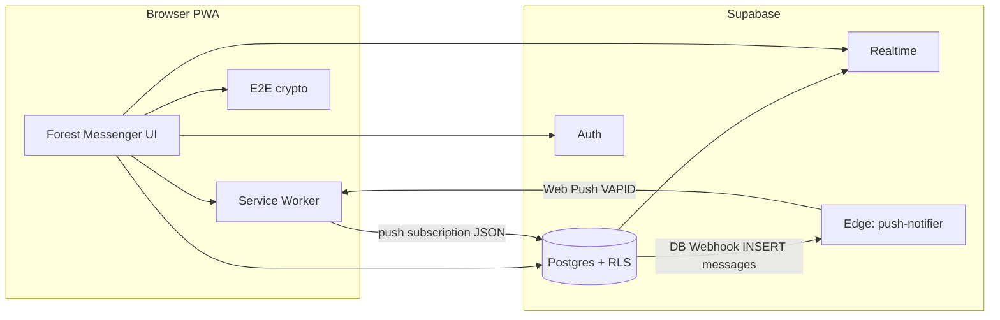

# 🐺 Forest Messenger

**Secure PWA Messenger // by [Rudy Wolf](https://rudywolf.ru)**

> Numb but alive. Awoo~ 💀
>
> Если ты это читаешь, значит, тебе нужен нормальный зашифрованный чат для своей стаи, где сервер слеп, как крот, а UI не выжигает глаза. Добро пожаловать в лес.


**Forest Messenger** — параноидальный, стерильный web-мессенджер в виде терминала: сквозное шифрование (E2E) текста, аудио и видео-кружочков, звонки по WebRTC, фоновые push-уведомления. Без своего Node-бэкенда: только Supabase как BaaS и криптография на клиенте.

_English:_ zero-trust E2E chat PWA — Next.js 14, Supabase, Web Crypto, PeerJS, Web Push (VAPID).

---

## 🩸 Стек технологий

| Слой | Технологии |
|------|------------|
| Приложение | Next.js 14 (App Router), React 18, TypeScript |
| UI | Tailwind CSS, Framer Motion (neon / noir, CRT scanlines) |
| Данные и auth | Supabase (PostgreSQL, Auth, Storage, Edge Functions) |
| Realtime | Supabase Realtime (WebSockets) |
| Крипта | Web Crypto API — AES-GCM-256, ECDH P-256, PBKDF2 |
| Звонки | WebRTC + PeerJS |
| PWA | `next-pwa`, Workbox, Web Push (VAPID) |

---

## 🐾 Архитектура: Zero Trust

Здесь не верят никому.

1. **Ключи:** генерируются на клиенте (ECDH). Приватный ключ шифруется паролем локального сейфа (PBKDF2 → AES-GCM), хранится в IndexedDB / localStorage; в БД — только публичные ключи.
2. **Медиа:** `Blob` → AES-GCM в памяти → только потом загрузка в bucket Supabase.
3. **Группы:** AES-ключ группы создаёт владелец и шифрует его отдельно для каждого участника.

Поток данных и push:



- Сообщения в БД — ciphertext; **RLS** открывает чат только участникам.
- **Push:** `PushSubscription` в таблице `push_subscriptions`; при `INSERT` в `messages` — **Database Webhook** → **`push-notifier`** → VAPID; SW показывает уведомление и открывает `data.url` (в т.ч. `?chat=`).

---

## ⚙️ Быстрый старт (локально)

**Нужно:** Node.js **≥ 18**, npm; **Docker** — опционально (удобно для единого окружения).

### 1. Репозиторий и окружение

```bash
git clone https://github.com/therudywolf/forest-messenger.git
cd forest-messenger
npm install
npm run setup
```

`npm run setup` генерирует пару VAPID-ключей и пишет **`.env.local`**. Альтернатива: скопировать **`.env.local.example`** → **`.env.local`** и заполнить вручную. Секреты (private VAPID, service role, webhook secret) не коммить и не класть в `NEXT_PUBLIC_*`.

Переменные описаны в **`.env.local.example`**.

### 2. Миграции Supabase

В SQL Editor проекта выполни файлы из **`supabase/migrations/`** по порядку:

| Файл | Смысл |
|------|--------|
| `00001_init.sql` | Таблицы, RLS |
| `00002_realtime_messages.sql` | Realtime для `messages` |
| `00003_media_messages.sql` | Медиа + storage |
| `00004_push_subscriptions.sql` | Подписки Web Push |

Или: `supabase db push` / `supabase link` — если используешь CLI.

### 3. Запуск

**Без Docker:**

```bash
npm run dev
```

Открой **http://localhost:3000**.

**С Docker (dev):**

```bash
npm run docker:dev
```

Используется **`Dockerfile.dev`** и **`docker-compose.yml`** (тома для `node_modules` и `.next`).

**Прод-сборка:** корневой **`Dockerfile`** (multi-stage, `output: 'standalone'`). При сборке передай `NEXT_PUBLIC_*` через build-args или CI, как у тебя принято.

---

## 📡 Прод и Web Push

1. Установи [Supabase CLI](https://supabase.com/docs/guides/cli), привяжи проект (`supabase link`).

2. Секреты для Edge (обход RLS в функции — **service role**; URL проекта подставляется средой Supabase):

```bash
supabase secrets set SUPABASE_SERVICE_ROLE_KEY="твой_service_role_ключ"
supabase secrets set VAPID_PRIVATE_KEY="твой_ключ"
supabase secrets set VAPID_PUBLIC_KEY="твой_ключ"
supabase secrets set VAPID_SUBJECT="mailto:твой@email.com"
supabase secrets set SITE_URL="https://твой-домен.ru"
supabase secrets set WEBHOOK_SECRET="рандомная_строка"
```

Публичный VAPID должен совпадать с **`NEXT_PUBLIC_VAPID_PUBLIC_KEY`** в клиенте.

3. Деплой функции:

```bash
supabase functions deploy push-notifier
```

4. **Database Webhook** в Dashboard:

   - Событие: `INSERT` в **`public.messages`**.
   - URL: `https://<project-ref>.supabase.co/functions/v1/push-notifier` (или твой кастомный домен функций).
   - Заголовок: **`x-webhook-secret`** = тот же `WEBHOOK_SECRET`, что в секретах.

> PWA и push в проде требуют **HTTPS**. Без HTTPS Service Worker и push не заведутся в нормальном режиме.

### PWA / Service Worker

- Push-логика в **`public/push-handler.js`**, подключается через **`next.config.js`** → `workboxOptions.importScripts`. Файл **`public/sw.js`** генерируется **next-pwa** при сборке — его не правь руками.
- Брендинг: **`public/wolf-logo.png`**, **`icon-192.png`**, **`icon-512.png`** (можно заменить на свои ассеты).

---

## 📁 Структура (кратко)

- **`src/app/`** — маршруты App Router, `manifest.ts`
- **`src/components/`** — UI (чат, звонки, уведомления)
- **`src/lib/`** — Supabase-клиенты, крипта, push
- **`supabase/migrations/`** — SQL
- **`supabase/functions/push-notifier/`** — Edge Function для пушей
- **`scripts/setup.js`** — интерактивная генерация `.env.local`

---

## 📄 Лицензия

Приватный / неопубликованный репозиторий — укажи лицензию при релизе.

---

**Связь с автором:**

[Telegram](https://t.me/rudy_wolf) | [X.com](https://x.com/therudywolf) | [GitHub](https://github.com/therudywolf)
