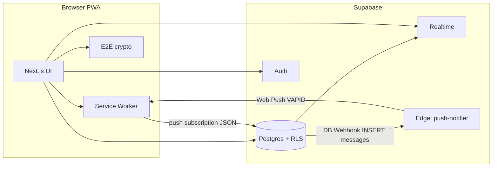

# Forest Messenger

Terminal-styled, installable PWA with E2E-encrypted chat, Supabase auth and realtime, WebRTC calls (PeerJS), and Web Push notifications.

## Tech stack

| Layer | Choice |
|--------|--------|
| App | Next.js 14 (App Router), React 18, TypeScript |
| Styling | Tailwind CSS, Framer Motion |
| Backend | Supabase (Postgres, Auth, Realtime, Storage) |
| PWA | `next-pwa` (Workbox) + `manifest.ts` |
| Push | VAPID + service worker `push-handler.js` + Edge Function `push-notifier` |
| Calls | PeerJS (WebRTC) |

## Architecture



- **Client** encrypts message content before insert; **RLS** restricts reads/writes to chat members.
- **Push**: the browser stores a `PushSubscription` in `push_subscriptions`. On new `messages` rows, a **Database Webhook** invokes **`push-notifier`**, which loads recipients’ subscriptions and sends a VAPID-signed payload. The service worker shows the notification and opens `data.url` on click.

## Quick start

1. **Requirements**: Node.js 18+, npm, optional Docker for `docker-compose` dev.

2. **Install**

   ```bash
   npm install
   ```

3. **Environment**

   ```bash
   npm run setup
   ```

   Or copy `.env.local.example` to `.env.local` and fill values. Keep **VAPID private key**, **webhook secret**, and **service role** out of git and out of `NEXT_PUBLIC_*` variables.

4. **Database**

   Apply migrations in `supabase/migrations/` (e.g. Supabase SQL editor or `supabase db push`).

5. **Push (Edge)**

   - Deploy `supabase/functions/push-notifier` to your project.
   - Set secrets: `SUPABASE_URL`, `SUPABASE_SERVICE_ROLE_KEY`, `VAPID_SUBJECT`, `VAPID_PUBLIC_KEY`, `VAPID_PRIVATE_KEY`, `SITE_URL`, and optionally `WEBHOOK_SECRET`.
   - In **Database → Webhooks**, add a webhook on `public.messages` **INSERT** with URL `https://<project>.supabase.co/functions/v1/push-notifier` (or your function URL) and header `x-webhook-secret: <same as WEBHOOK_SECRET>`.

6. **Run**

   ```bash
   npm run dev
   ```

7. **Docker (dev)**

   ```bash
   npm run docker:dev
   ```

   Uses `Dockerfile.dev` with bind mounts. **Production** image: root `Dockerfile` (multi-stage `standalone`). Pass build args for `NEXT_PUBLIC_*` as needed.

## PWA notes

- Workbox injects `public/push-handler.js` for `push` and `notificationclick`. Generated `public/sw.js` is build output; edit push behavior in `push-handler.js` and `next.config.js` `workboxOptions.importScripts`.
- Place branding assets under `public/` (e.g. `wolf-logo.png`, `icon-192.png`, `icon-512.png`).

## License

Private / unreleased — adjust as needed.
